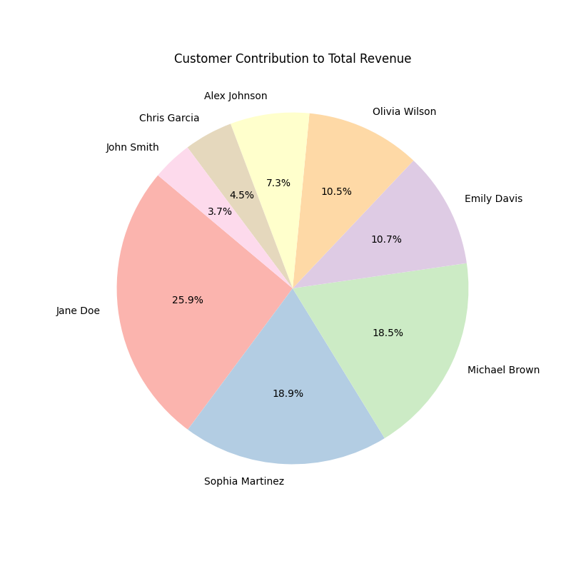

# Real-Time Retail Data Warehouse

## 📌 Introduction

This project simulates a **data warehouse** system for a retail store, processing **real-time** purchase data from Kafka and storing it in PostgreSQL. The system supports sales data analysis, inventory control, and visual reporting.

## 🚀 Features

- **Simulates product import and sales operations** of the store.
- **Processes streaming data** from Kafka using Apache Spark.
- **Stores purchase data** in a **data warehouse** following the **star schema** model.
- **Monitors inventory levels** to prevent overselling.
- **Analyzes revenue & sales quantity**, displaying reports with **charts and graphs**.

## 🏛️ Data Warehouse Architecture

The system uses a **star schema** with the following tables:

- **Fact Table:** `sales_fact` (contains purchase transaction data)
- **Dimension Tables:**
  - `product_dim` (product information)
  - `customer_dim` (customer information)
  - `time_dim` (purchase time)

## 📂 Folder Structure

```
├── analysis                        # Data analysis and visualization scripts
├── config                          # Configuration files
│   ├── postgres_setup.py           # PostgreSQL setup script
├── input                           # Input data sources
│   ├── backup                      # Backup data
│   │   ├── import                  # Backup of import data
│   │   ├── purchase                # Backup of purchase data
│   ├── filestreaming_import_goods  # Input for import streaming
│   ├── kafka_purchase              # Input for Kafka streaming purchases
├── src                             # Source code
│   ├── generate_simulation_data    # Simulated data generators
│   ├── utils                       # Utility functions
│   │   ├── sent_json_to_kafka.py   # Send JSON data to Kafka
│   ├── query_helper                # Helper functions for queries
│   ├── spark_filestreaming_import_goods
│   │   ├── update_database_streaming.py # Updates inventory
│   ├── spark_kafka_streaming_purchase
│   │   ├── handle_kafka_data.py    # Processes Kafka purchase data in real-time
```

## ⚙️ Technologies

- **Apache Spark**: Processes streaming data from Kafka.
- **PostgreSQL**: Stores data using the Data Warehouse model.
- **Python (pandas, matplotlib)**: For data analysis and chart plotting.
- **Kafka**: Receives purchase transaction data.

## 📊 Visualizations

The project provides examples of reports generated after 3 product imports and 50 purchase transactions:

- **Revenue by Product** (`pie chart`)
- **Quantity Sold per Produc** (`bar chart`)
- **Revenue per Customer** (`pie chart`)
- ...

Example: Revenue per Customer.



## 📖 Usage

1. **Clone repo:**
   ```sh
   git clone https://github.com/epsi10nvn/RealTime-Sales-Inventory.git
   cd RealTime-Sales-Inventory
   ```
2. **Set up the environment:**
   - Install PostgreSQL, Kafka, and Spark.
   - Install required libs from `requirements.txt`.
3. **Running**
   Create tables in the PostgreSQL database
   ```sh
   python config/postgres_setup.py
   ```
   Generate import data
   ```sh
   python src/generate_simulation_data/generate_import_goods_invoices.py
   ```
   Process import data
   ```sh
   python scr/spark_filestreaming_import_goods/update_database_streaming.py
   ```
   Start the purchase order processing program
   ```sh
   python src/spark_kafka_streaming_purchase/handle_kafka_data.py
   ```
   Generate purchase transaction data
   ```sh
   python src/generate_simulation_data/generate_purchase_invoices.py
   ```
4. **Analyze the data**
   ```sh
   python analysis/analyze.py
   ```

## 💡 Contributions

All contributions are welcome! Feel free to create a **pull request** or open an **issue** if you have any improvement ideas.
